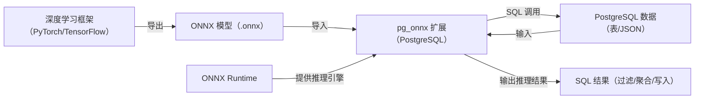

##  ONNX 
ONNX 是跨框架、开放的机器学习模型中间表示标准，核心价值是打破 PyTorch、TensorFlow 等框架的兼容性壁垒，成为模型“通用语言”。它通过定义统一算子集、规范 PB 存储格式（.onnx 文件），支持动态维度适配，配套 `onnxoptimizer` 等完善工具链，广泛用于模型跨框架迁移、统一管理及推理引擎适配场景。

##  ONNX Runtime 
ONNX Runtime 是微软主导的跨平台高性能 ONNX 模型推理引擎，是 ONNX 生态的核心执行层。它能解析并优化 ONNX 模型，支持 CPU、GPU、边缘设备等多硬件适配与自动加速，通过算子融合、硬件指令集优化提升推理性能，提供多语言 API 适配不同部署场景，是各类 ONNX 模型部署（含数据库集成）的核心依赖。

## pg_onnx 
pg_onnx 是 PostgreSQL 数据库的 ONNX 集成扩展，核心目标是实现“近数据推理”。它通过 SQL 原生函数支持 ONNX 模型的导入、查询、删除全生命周期管理，可直接以数据库表字段或 JSON 数据为输入执行推理，无需外部服务，减少数据传输开销。其底层依赖 PostgreSQL 14+ 和 ONNX Runtime，曾因依赖的 onnxruntime-server 子项目逻辑缺陷，存在多动态维度输入的形状计算报错问题。

### 三者核心关系总结

- **ONNX**：是“桥梁”，连接训练框架和推理引擎，解决模型格式不兼容问题；
- **ONNX Runtime**：是“发动机”，提供高性能推理能力，适配多硬件，pg_onnx 依赖其实现核心推理；
- **pg_onnx**：是“连接器”，将 ONNX Runtime 嵌入 PostgreSQL，让数据库具备“数据存储+实时推理”一体化能力。

三者协同解决了“模型跨框架迁移→高效推理→数据库内本地化执行”的全链路需求，也是用户使用 pg_onnx 时的核心技术链路。

## pg_onnx的一些限制和BUG修复
### max supported IR version: 11 和 opset 23
```sql
test=# SELECT pg_onnx_import_model(
               'simple_model',
               'v2', 
               PG_READ_BINARY_FILE('/home/postgres/model/simple_model.onnx')::bytea,
               '{"cuda": false}'::jsonb, 
               'simple_model'
       );
ERROR:  pg_onnx_inspect_model_bin: /onnxruntime_src/onnxruntime/core/graph/model.cc:181 onnxruntime::Model::Model(onnx::ModelProto&&, const onnxruntime::PathString&, const onnxruntime::IOnnxRuntimeOpSchemaRegistryList*, const onnxruntime::logging::Logger&, const onnxruntime::ModelOptions&) Unsupported model IR version: 12, max supported IR version: 11
test=# SELECT pg_onnx_import_model(
               'simple_model',
               'v2', 
               PG_READ_BINARY_FILE('/home/postgres/model/simple_model.onnx')::bytea,
               '{"cuda": false}'::jsonb, 
               'simple_model'
       );
ERROR:  pg_onnx_inspect_model_bin: /onnxruntime_src/onnxruntime/core/graph/model_load_utils.h:46 void onnxruntime::model_load_utils::ValidateOpsetForDomain(const std::unordered_map<std::__cxx11::basic_string<char>, int>&, const onnxruntime::logging::Logger&, bool, const std::string&, int) ONNX Runtime only *guarantees* support for models stamped with official released onnx opset versions. Opset 24 is under development and support for this is limited. The operator schemas and or other functionality may change before next ONNX release and in this case ONNX Runtime will not guarantee backward compatibility. Current official support for domain ai.onnx is till opset 23.
```
### 输入张量的形状计算不对
这里的det的原始输入张量形状为(-1,3,-1,-1)，实际输入的coordinates.json是一个形状为(1, 3, 160, 160)，总元素数量76800，报错如下
```sql
(onnx-env) postgres@zxm-VMware-Virtual-Platform:~$ psql test
psql (16.10)
Type "help" for help.

test=# select * from pg_onnx_list_model() where name = 'det';
 name | version |     option      |            inputs            |                 outputs                 | description |          created_at           | lo_oid 
------+---------+-----------------+------------------------------+-----------------------------------------+-------------+-------------------------------+--------
 det  | v1      | {"cuda": false} | {"x": "float32[-1,3,-1,-1]"} | {"fetch_name_0": "float32[-1,1,-1,-1]"} | det         | 2025-10-22 17:59:12.502754+08 |  33180
(1 row)

test=# SELECT pg_onnx_execute_session(
    'det', 
    'v1', 
    pg_read_file('/home/postgres/OnnxOCR/coordinates.json')::jsonb
);
ERROR:  pg_onnx_internal_execute_session: tried creating tensor with negative value in shape
```
原因在于，pg_onnx依赖的子项目[onnxruntime-server](https://github.com/kibae/onnxruntime-server)对于多维张量的计算是存在问题的，在计算的过程中会调用input_value::batched_shape这个函数，函数实现如下
```c++
std::vector<int64_t>
onnxruntime_server::onnx::execution::input_value::batched_shape(const std::vector<int64_t> &shape, size_t value_count) {
	// check shape contains -1
	if (std::find(shape.begin(), shape.end(), -1) == shape.end())
		return shape;

	// calculate batch size
	std::vector<int64_t> shape_copy = shape;
	int64_t batch = (int64_t)value_count;
	for (auto &s : shape_copy) {
		if (s != -1)
			batch = (int64_t)std::max((double)1, std::ceil((double)batch / (double)s));
	}

	// replace -1 with batch size
	for (auto &s : shape_copy) {
		if (s == -1) {
			s = batch;
			break;
		}
	}

	return shape_copy;
}
```
而输入这是原始张量形状和当前输入张量的元素总数分别是(-1, 3, -1, -1)和76800，导致最终计算结果为(25600, 3, -1, -1)，这和实际输入张量的形状(1, 3, 160, 160)完全是对不上的，所以导致报错。然后我就尝试着修复了一下

